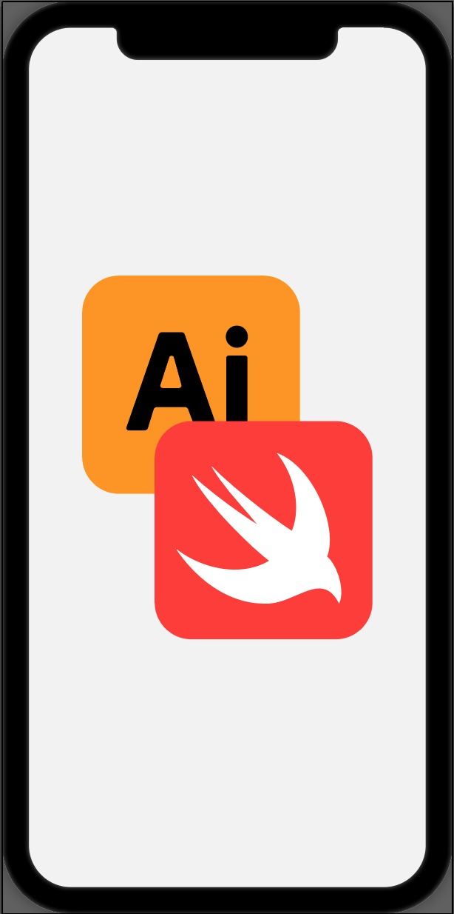
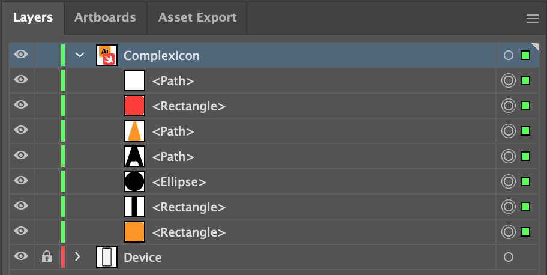
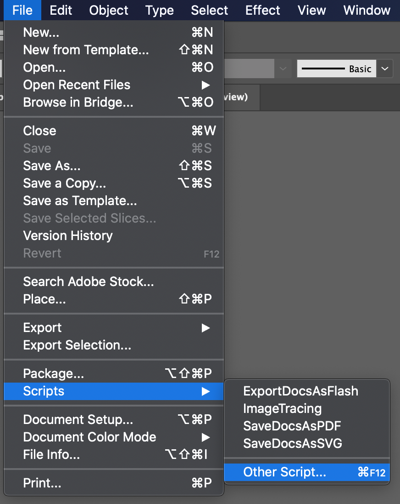
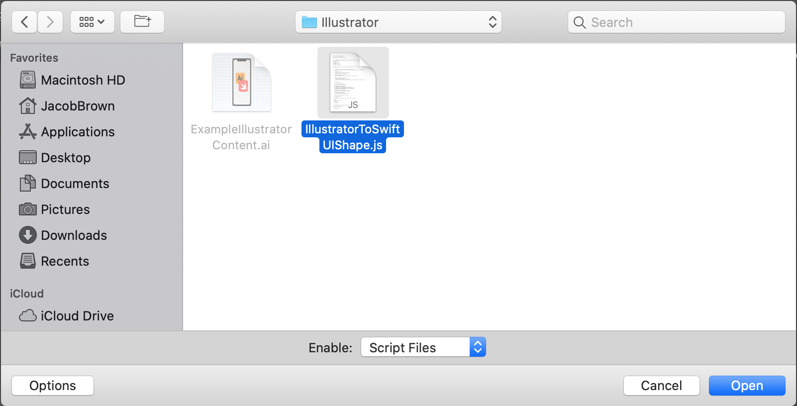
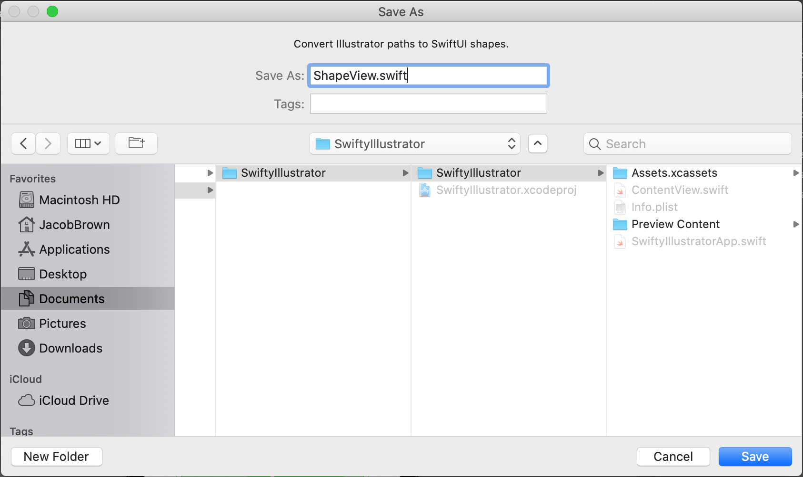
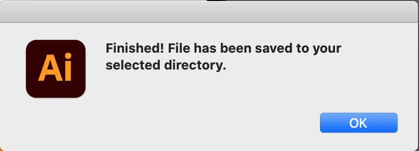
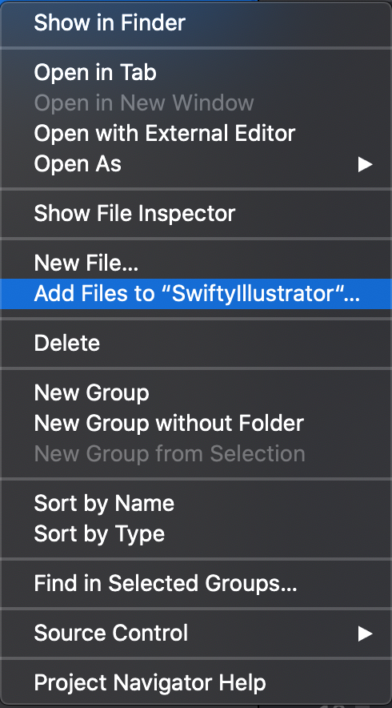
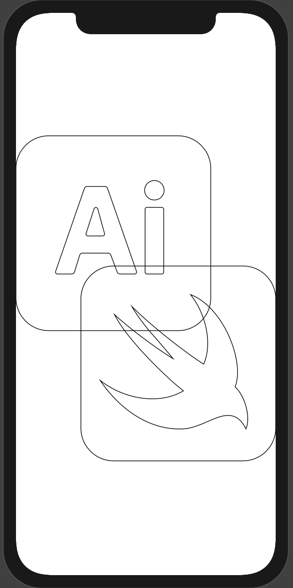

# SwiftyIllustrator

A tool for quickly converting Adobe Illustrator shapes into SwiftUI code.

## Description

This tool utilizes the built-in scripting of Adobe Illustrator ("AI") to convert shapes drawn with AI into swift code. The included [javascript](./Illustrator/IllustratorToSwiftUIShape.js) iterates over each point of an AI shape and converts the shape into a series of CGPaths that are wrapped in a SwiftUI view for easy implementation into your XCode project. 

## Installation

Just grab a copy of this repo.

## Usage Outline

1) Create a custom shape or shapes in the included [AI file](./Illustrator/ExampleIllustratorContent.ai)
2) Center the custom shape(s) on the artboard
3) Select the custom shape(s) to be converted to swift code
4) Run the included [javascript](./Illustrator/IllustratorToSwiftUIShape.js) using Illustrator's built in scripting (for more info, see [Adobe's guide](https://www.adobe.com/devnet/illustrator/scripting.html))
5) Save the script's output text as a .swift file
6) Import the .swift file into your XCode project
7) Implement the generated SwiftUI view as you please

## Detailed Usage Example

In this example, we'll be converting the SwiftyIllustrator icon (drawn using AI) into a SwiftUI view.

* To begin, open the included [AI file](./Illustrator/ExampleIllustratorContent.ai), which has the SwiftyIllustrator icon already drawn on the lone artboard


* Select all of the logo elements (_e.g._, using the Group Selection Tool)


* Navigate to AI's built in scripting dialog via File -> Scripts -> Other Script...


* Select the included [javascript](./Illustrator/IllustratorToSwiftUIShape.js) file and run it


* Choose a name and destination for the script's output (_e.g._, "ShapeView.swift")


* If successful, you should see the below alert


* Then, add the new .swift file to your XCode project


* After opening XCode's canvas to preview the new SwiftUI view, you should see a wireframe of the SwiftyIllustrator icon


* At the top of the new .swift file, you'll notice a single SwiftUI view comprising the seven elements of the SwiftyIllustrator icon. 
```swift
// MARK: - ShapeView
struct ShapeView: View {
    
    var body: some View {
        ZStack {
            ShapeElement7().stroke(lineWidth: 1.0)
            ShapeElement6().stroke(lineWidth: 1.0)
            ShapeElement5().stroke(lineWidth: 1.0)
            ShapeElement4().stroke(lineWidth: 1.0)
            ShapeElement3().stroke(lineWidth: 1.0)
            ShapeElement2().stroke(lineWidth: 1.0)
            ShapeElement1().stroke(lineWidth: 1.0)
        }
    }
}
```

* In the SwiftUI View, you can change the appearance of the individual shape elements (_e.g._, adding fills, strokes etc.) as you please, as well as adding animations to the individual elements, to create compelling, dynamic content in pure Swift code! 


## Other Info

This project was tested using: 
* Illustrator 24.2
* XCode 12.2

## Contributing
Pull requests are welcome. For major changes, please open an issue first to discuss what you would like to change.

## License
[MIT](https://choosealicense.com/licenses/mit/)
